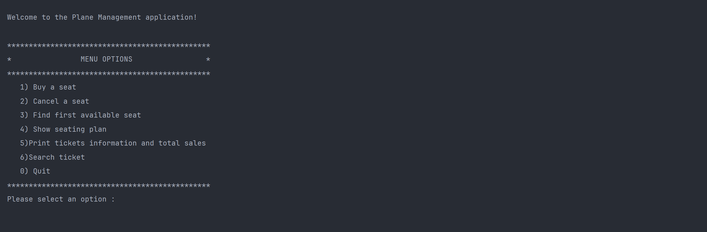
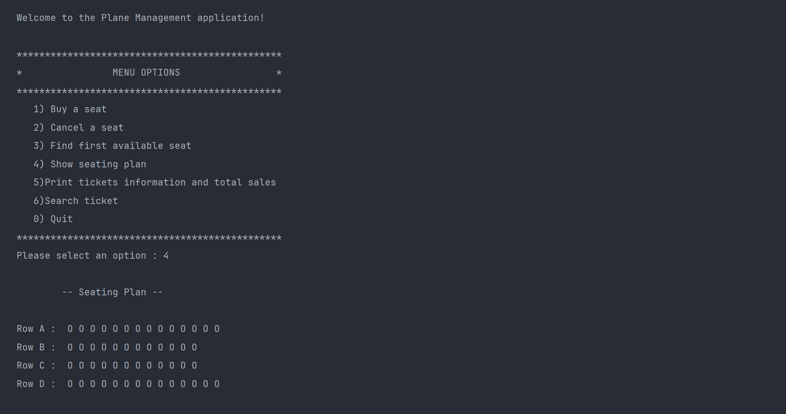

# Plane Ticket Booking System (Java)

A console-based Java application for managing plane seat reservations. The system allows users to buy, cancel, search, and view tickets, as well as print ticket information and total sales. Data is saved to text files for each ticket.

## Features

- Buy and cancel plane tickets
- Find the first available seat
- Show seating plan (rows A, B, C, D)
- Print all tickets and total sales
- Search for ticket information by seat
- Save ticket details to text files

## Technologies

- Java (OOP)
- File I/O (text files)

## Setup

1. Clone the repository:
2. Open the project in IntelliJ IDEA.
3. Build the project.

## Usage

- Run the `W2053428_PlaneManagement` class.
- Use the console menu to interact with the system.

## Project Structure

- `src/W2053428_PlaneManagement.java` - Main application logic and menu
- `src/Ticket.java` - Ticket details, price calculation, and file saving
- `src/Person.java` - Person details for ticket holders

## 📱 Application Demo

### Main Menu Interface

*Interactive console menu with booking options*

### Seat Selection Process

*Real-time seat availability display*

## How It Works

- Seats are managed in arrays for each row (A, B, C, D).
- Tickets are stored in a 2D array, with each ticket linked to a person.
- When a ticket is purchased, details are saved to a text file named by row and seat (e.g., `A1.txt`).

## License

MIT License
